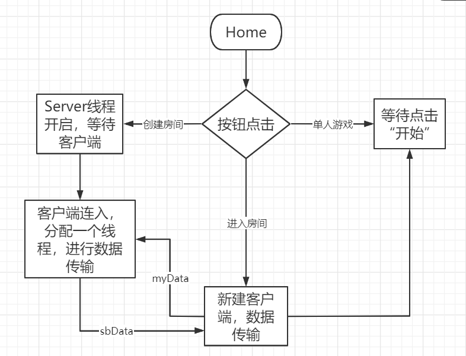
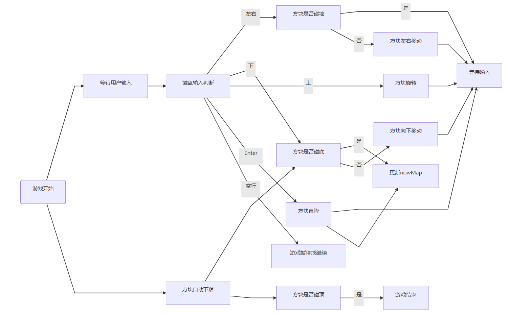
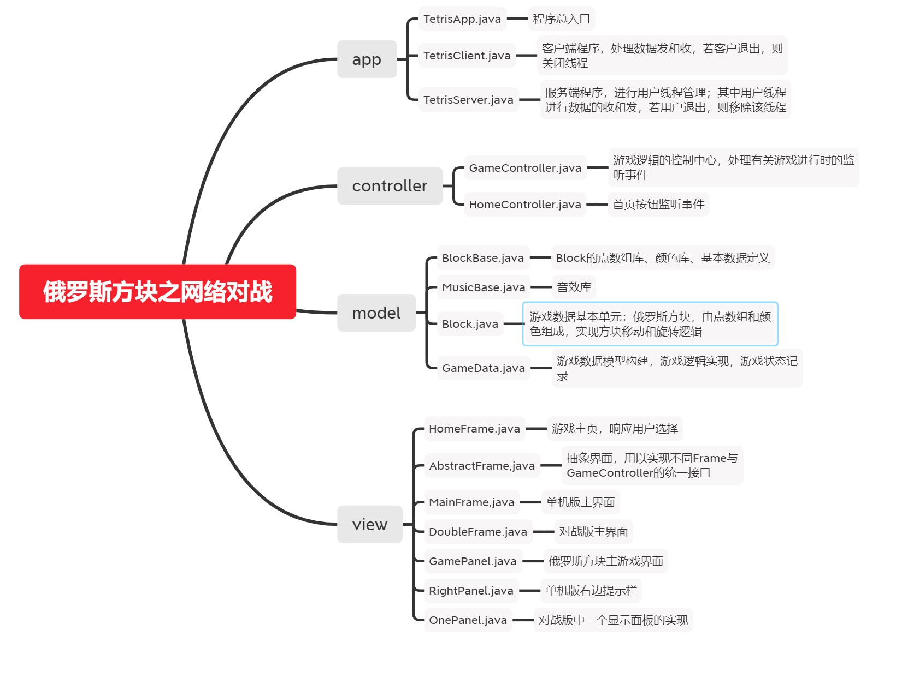
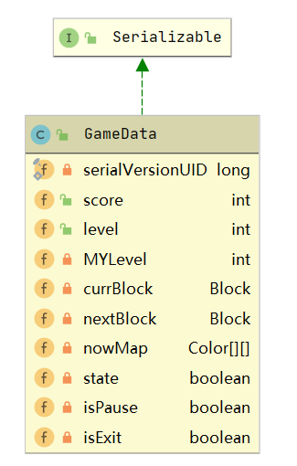
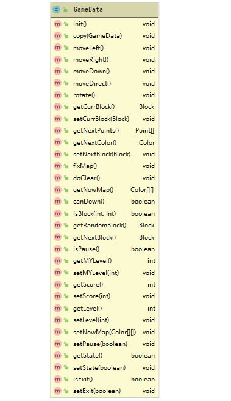
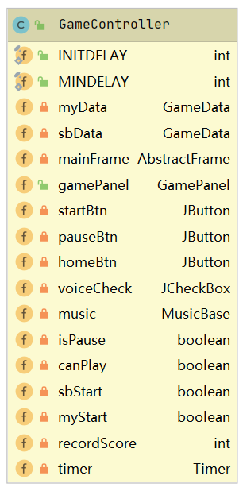
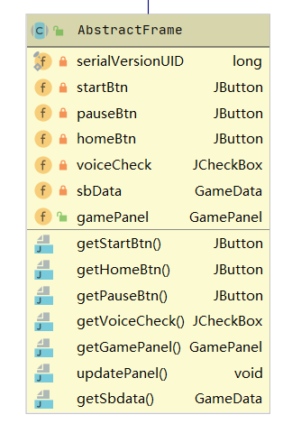
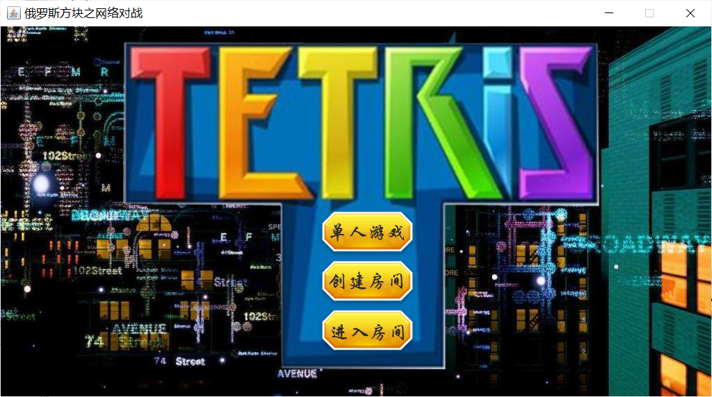

需求确认->概要设计->详细设计->编码->重构->测试->压测。

规范：需求分析、系统设计、系统实现部分。

描述：文字描述准确，所描述的类图、程序流程图准确。

# 俄罗斯网络对战游戏

## 1、需求分析

1）实现俄罗斯方块的基本游戏逻辑：如方块的自动下落、操作左右下移动、操作旋转、操作直落、方块消行、方块碰底及碰顶判断。这些操作，是对游戏数据的底层修改，可以将其封装在数据操作层（model构建）里面，进行统一管理，每当监听（controller构建）到相应事件输入（view构建即图形界面和用户进行交互）后，程序调用该数据操作即可。

2）利用Socket编写服务器端和客户端程序：根据“三次握手四次挥手”原理编写，用ObjectInputSream和ObjectOutputSream收发游戏数据层类，以此定义网络通信协议。

3）实现俄罗斯方块的联网对战功能：如创建服务端后，客户端连接服务器，传送己方数据给服务端，服务端接收数据并传给另一个客户端，另一个客户端将收到他方数据，这样即可完成数据通信，根据他方数据做成图形界面进行直观对比，达到对战效果。

4）实现计分、音效等辅助功能：可根据消行数来记录分数，音效响应相关按键或点击事件即可。

## 2、系统设计

### 2.1 设计模式

MVC框架，即model-view-controller（模型-视图-控制器），适用于交互编程项目开发。

- Model：游戏数据模型构建、游戏状态记录、游戏逻辑操作实现

- View：游戏界面设计，响应用户操作，并呈现Model的操作结果给用户，主要实现数据到页面转换过程。 

- Control：负责控制view和model之间的联系，即control根据view响应的用户操作，调用model中的逻辑处理，并将处理结果传给view进行显示。

### 2.2 逻辑设计

**HomeController按钮点击控制游戏**

**GameController键盘输入控制线**

### 2.3 类的设计

**重要类设计说明**

#### 1）游戏核心数据GameData

- 构造GameData(),GameData(GameData)

- 数据模型：score,level,currBlock,nextBlock,nowMap。其中score记录消行数即得分；level随着分数的增加取分数模MyLevel结果，以此设置游戏方块下降速度，自动增加难度；nowMap存储20*10的主游戏面板的颜色Color[][]数据。

- 游戏状态：state,isExit,isPause，响应外界事件进行值的变化，state为游戏是否进行，isExit为界面是否关闭，isPause判断游戏是否暂停，是则添加暂停图标。

- 游戏逻辑：move**()，控制currBlcok的移动，rotate()控制其旋转，getRandomBlock()获取随机方块更新nextBlock，fixMap()填充nowMap，doClear()执行消行操作并记录分数、更新等级，canDown()能否下移的判断，若不能则调用fixMap()。

#### 2）游戏核心控制GameController

- 构造GameController(GameData,AbstractFrame)

- 游戏数据：myData记录己方数据；sbData记录对方数据，如果是单人版则为null；gamePanel和mainFrame获取监听事件并控制更新界面；recordScore记录之前的得分对比更新得分，若不同则播放得分音效；music音效库。

- 游戏状态：myStart记录己方游戏是否开始，sbData记录对方游戏是否开始，canPlay记录是否开启音效，isPause记录游戏是否暂停。

- 事件监听：timer为开启后的游戏进程，控制方块自动下落，监听己方或对方游戏是否开始或结束，实时更新界面并辅助GamePanel夺回焦点以便键盘控制；键盘监听上（旋转）、下（移动）、Enter（直降）、左右（移动）、空格键（暂停）；startBtn监听游戏的开始和终止，pauseBtn监听游戏的暂停和继续；voiceCheck监听游戏音效使能。

#### 3）抽象界面AbstractFrame

内置数据和功能按钮，统一接口，获取按钮和对方数据，以此构造GameController。

#### 4）网络程序分析

- 服务端
  1. 客户端连接服务器后，将不多于两个的客户端放入threads中进行数据交换。
  2. 设置内部线程类，为进入的客户端分配线程，进行数据收发，若用户退出，则关闭该socket，并设置线程canRun为false，将该线程移除threads中。

- 客户端

  连接服务器后，开始发收数据，若用户退出，则关闭该socket。

### 2.4 UI设计

#### HomeFrame

#### MainFrame(单机版)

.png)

#### DoubleFrame(对战版)

.png)

## 3、参考资料

1. [python俄罗斯方块_专题_脚本之家 (jb51.net)](https://www.jb51.net/Special/988.htm)
2. [基于Java的俄罗斯方块游戏的设计与实现 - RunWsh - 博客园 (cnblogs.com)](https://www.cnblogs.com/chenqiwei/p/runwsh_elsfk.html#_label2)
3. [write-bug (writebug.com)](https://www.writebug.com/git/codes?owner=YOUandME&repo=Trias_system)
4. [Java Socket通信实现带联机功能的俄罗斯方块_MADAO__G的专栏-CSDN博客_俄罗斯方块java联机](https://blog.csdn.net/a343902152/article/details/49914759)

## 4、后记

**写给完成实验后的自己**

想重构：把BlockBase去掉，放在Block里面，要改好多哦